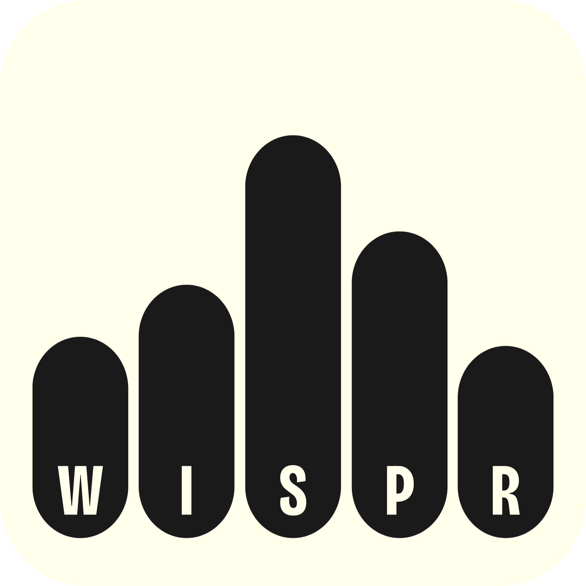

  

<h1 align="center">Wispr Stories</h1>

  <em>Turn your voice into shareable cards, in your language, in seconds.</em>

  Independent project &middot; Not affiliated with Wispr Flow

  Turn your voice into shareable cards, in your language, in seconds.
   
  No account · No install · 21 languages · speak or type in any language your browser supports

  <a href="https://wisprstories.vercel.app"><strong>Live Demo →</strong></a>

  
  
  

---

<!-- TODO: Add screenshot of the card UI here -->

## What Is Wispr Stories?

Wispr Stories is a browser-based tool that turns voice into a shareable card. Anyone — a grandparent, a student, a founder — opens the app, speaks or types something meaningful, and receives a beautiful visual card they can download or send straight to WhatsApp, Instagram, iMessage, X, or any app on their device via the Web Share API.

**The core insight:** Wispr Flow is powerful but invisible. People dictate emails, recipes, and memories every day — but none of it is shareable. Wispr Stories is the social layer that was missing.

Wispr Stories is an independent fan project — not affiliated, not sponsored. [Wispr Flow](https://wisprflow.ai?ref=wispr-stories) is credited in the page footer and shared-link previews; the cards themselves carry only the user's words and a small Wispr Stories mark.

## The Grandparent Test

> If a 70-year-old who only uses WhatsApp can open the app, speak a birthday message, and share the card in under 60 seconds — the app passes. If they cannot, it fails.

## How It Works

1. **Open the app** — no login, no install, no account required
2. **Speak or type** — tap Record and speak naturally, or type/paste text
3. **Choose your style** — pick a tone, card colour, and aspect ratio
4. **Create your card** — one tap to render a beautiful visual card
5. **Share anywhere** — download as PNG, copy to clipboard, or tap Share to send straight to any app on your device (WhatsApp, Instagram, iMessage, X, email…)

## Features

- 🎙️ **Speak or type** — record your voice or just type
- ✨ **AI tone rewriting** — tap a tone (Warm, Bold, Poetic, Playful, Reflective, Honest) and your message is rewritten to match
- 🎨 **6 color palettes** — Violet, Amber, Crimson, Emerald, Ocean, Rose
- 📐 **4 aspect ratios** — Instagram, widescreen, universal, Stories
- 🌍 **21 languages** — the app interface and your card both work in your language
- 📱 **Built for phones** — full mobile-first design with native share
- 🌙 **Dark mode** — follows your system preference
- 🔒 **Privacy-first** — your audio never leaves your browser. Shared-link cards auto-expire after a couple of days. No accounts, no tracking.

## Try It

No install. No account. [Open the live demo](https://wisprstories.vercel.app) and start speaking.

## Built With

| Tech | Role |
|---|---|
| HTML, CSS, JavaScript | The whole app — no framework |
| Vercel | Hosting |
| Web Speech API | Voice transcription in your browser |
| Deepgram | Voice transcription fallback when your browser doesn't support it |
| OpenRouter | AI tone rewriting |
| PWA | Install it on your phone or desktop; typing works offline |

## Browser Support

Works in Chrome, Edge, and Safari. Firefox supports typing and paste only — voice recording isn't available there.

## What's Next

- 🎧 **Voice-attached cards** — tap the waveform on a shared card to hear the original voice
- 🔗 **Animated shareable links** — open a card as a live web page, not just a static image

## Acknowledgments

- **[Wispr Flow](https://wisprflow.ai)** — the voice input product this project complements
- **[Vercel](https://vercel.com/)** — hosting
- **[Google Fonts](https://fonts.google.com/)** — typography

---

  Made with 🎙️ and ✨ · <a href="https://wisprstories.vercel.app">wisprstories.vercel.app</a>

